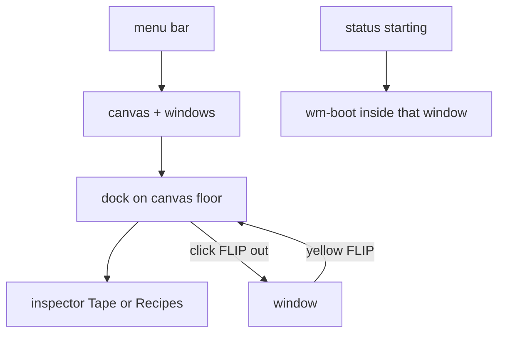

# Complete instructions — operator desktop UI

You are a coding agent. Implement the **host-page operator desktop** for WebMCP Computer. This file is the complete brief. [PLAN.md](PLAN.md), [HANDOFF.md](HANDOFF.md), and [VERIFY.md](VERIFY.md) are the same content split for reference — if they disagree, **this file wins**.

`plans/REQUIREMENTS.md` is the product invariant. Do not remove working features to match old tables. After this lands, append one short **Host chrome** paragraph under REQUIREMENTS §7 (docked inspector, side-by-side shots, no page BIOS, per-computer starting overlay, glass desktop). Do not rewrite the whole spec first.

Older `plans/*` (Nova/Forge, Axiom-on-paper, full-screen Action TimeLine) are stale for layout. Live CSS is already glass macOS. Ember is **only** on Approve (or the primary destroy choice).

---

## 0. Product

The page is the operator console for an agent-operated lab — not a website with a dock sticker.

1. **Place** — a real desktop surface; computers are windows in space.
2. **Fleet** — the dock switches, spawns, hides computers. It **never hides** when the inspector opens (it is the minimize target).
3. **Inspector** — Chrome DevTools style, **pushes** the canvas. Tape | Recipes. Never a full-viewport modal.

Agent `typeText` is **60 WPM in the guest** with a soft per-key sound. Do not dump the string.

**Application start has no boot animation.** First paint is the desktop. The **only** boot theater is the overlay **inside a computer window** while `status === "starting"`.

```
grid-template-rows: 28px 1fr auto
[ MenuBar 28px ]
[ .desktop  — wallpaper, windows, dock overlay at the canvas floor ]
[ .inspector  — 0 when closed; --insp-h when open, default 38vh ]
```



---

## 1. Parallel track — consume, do not fight

Written against **in-flight hardening**, not last week’s `main`. `git grep` if unsure.

| Incoming | What you do |
|----------|-------------|
| `store.tape` + WS `prependTape`; timeline poll already gone | Keep `merge(one GET /api/tape on open, store.tape)`. Rewrite the **view** only. No polling. |
| MenuBar `apiOnline` | One Offline pill. No second indicator. |
| `MachineTools` always mounted | Empty state: tools are **already live**. |
| `wm.arrange()` + `workspace_arrange_windows` | Interpolate bounds. Transitions off only while `.dragging` / `.resizing`. |
| `/api/actions` CRUD + promote + replay | Recipes **tab**. No new backend. No second overlay. |
| `Approval.options` + `/choose` | Style the sheet. Do not add `{ saveFiles }` on `/approve`. |
| `home_archives` table; no `/api/archives` yet | Hide Restore on 404 or empty. |
| `SHOT_SKIP_OPS` + optimistic tape | Most events have no shots. Two placeholders. |
| `prependTape` skips same `id` | **Replace** same id so `before`/`after` can update. |
| No `durationMs` on `TapeEvent` | Min bar width ~8px. Do not edit `plane.ts`. |
| Red traffic light = `destroyComputer` | Close does not FLIP to the dock. Yellow = hide. |
| `actionsOpen` on the UI slice | Fold into inspector tab state. Do not add a third overlay flag. |

### APIs you may call

```
GET    /api/tape
GET    /api/tape/:id/before
GET    /api/tape/:id/after
GET    /api/actions
GET    /api/actions/:id
POST   /api/actions              { name, description?, steps? }
POST   /api/actions/promote      { count?, name, description? }
POST   /api/actions/:id/replay   { speed? }     130s timeout, x-actor: human
DELETE /api/actions/:id
POST   /api/computers            { name?, role?, restoreArchiveId? }
GET    /api/archives             optional — 404 is fine
```

Promote default `count` is 10. After success, switch to Recipes and select the new id.

---

## 2. Ownership

### You own

- `apps/web/src/ui/Shell.tsx`
- `apps/web/src/ui/Dock.tsx`
- `apps/web/src/ui/wm/Canvas.tsx`
- `apps/web/src/ui/wm/Window.tsx`
- `apps/web/src/ui/wm/ComputerBoot.tsx` (new, optional extract)
- `apps/web/src/ui/wm/motion.ts` (new)
- `apps/web/src/ui/inspector/Inspector.tsx` (new)
- `apps/web/src/ui/inspector/RecipesPanel.tsx` (new)
- `apps/web/src/ui/ActionTimeline.tsx` (view rewrite; keep live-tape merge)
- `apps/web/src/ui/sound.ts`
- `apps/web/src/styles/axiom.css`
- `apps/web/index.html`
- **Delete** `apps/web/src/ui/BootSequence.tsx`

### Shared — rebase, do not rewrite

- `apps/web/src/ui/MenuBar.tsx` — keep `apiOnline`; Offline pill; Timeline / Recipes; **delete Boot**
- `apps/web/src/store/slices/wm.ts` — keep `arrange()`; add `restoring`
- `apps/web/src/store/slices/ui.ts` + `store/index.ts` — delete `booted`, `justBooted`, `bootNonce`, `finishBoot`, `replayBoot`; persist `sound` only (not `booted`); inspector tab state
- `apps/web/src/store/slices/server.ts` — `prependTape` replace-by-id; later `restoreArchiveId`
- `apps/web/src/webmcp/MachineTools.tsx` — 200ms `typing` scheduler around `typeText` only

### Surgical API/bridge (only these)

- `apps/bridge/src/desktop.ts` `typeText`: `xdotool type --delay 200 -- <text>`
- `apps/api/src/http-machine.ts`: `typeText` timeout `min(120_000, 1000 + text.length * 220)`

### Do not touch

`plane.ts`, `docker-host.ts`, `tape-store-*`, `action-store.ts`, `WorkspaceTools.tsx` (you may **call** its APIs), contract `requiresApproval`, `deploy/`, nginx, systemd.

---

## 3. Hard rules (do not)

- Hide the dock when the inspector opens
- Keep or reintroduce the page **BootSequence** / menubar Boot / `.booted-fresh` assemble
- Reintroduce `/api/tape` polling
- Keep the before/after **slider** (`Compare`, `.tl-compare`)
- Dump `typeText` as one xdotool burst
- Split `typeText` into N `/api/act` calls
- Sonify hover, app-boot ticks, tape arrivals, or use a `processing` loop as typing
- Play `typing` for human VNC or for `key` chords
- Add a second Actions modal
- Edit `plane.ts` for `durationMs`
- Mesh/WebGL genie — FLIP-to-tile only
- Wallpaper photograph or a 1 MB asset
- Desktop icons, fake HD, light mode
- Treat `prefers-reduced-motion` as mute

---

## 4. Implementation order

Do in order. Step 9 can overlap 7–8.

1. **Kill app boot.** Remove `BootSequence`, `replayBoot`, persist `booted`, Boot menu, `.bootseq*` / `.booted-fresh`. Unblock Shell keys (`if (!s.booted) return` must go). First paint = desktop.
2. **Shell grid** `28px 1fr auto`. Inspector pushes the canvas. Dock stays on the canvas floor.
3. **Surface.** CSS wallpaper, delete `/canvas-bg.svg`, drop `.grain`, empty-state card, `index.html` identity.
4. **MenuBar rebase.**
5. **Dock** + `getDockTileRect(id)`.
6. **Motion.** FLIP min/restore; interpolate max / snap / `arrange()`; rAF drag.
7. **Computer boot overlay** (section 6) for the full `starting` period.
8. **Tape waterfall** + side-by-side shots; titlebar Timeline → filter that computer.
9. **Recipes tab** against `/api/actions*` (degrade if 404).
10. **uisfx + 60 WPM `typeText`.**
11. **Archives UI** only if `GET /api/archives` exists.
12. **Verify** (section 14). Browser, not a screenshot.

---

## 5. Layout and chrome

### Shell

Today: menubar + full-bleed `.desktop` + `.tl-root { position: fixed; inset: 0; z-index: 200 }`.

Delete that overlay model. Inspector is the third grid row. Height drag-resizable (top handle), `localStorage.webmcp.insp-h`, min 220px, max 60vh.

- Esc: lightbox → inspector → approval
- Menubar **Timeline** → Tape tab, filter All
- Menubar **Recipes** → Recipes tab
- z-index: windows < dock < inspector < approval
- Shot lightbox **inside** the inspector
- Maximize `ch - 88` must use the **shrunk** canvas

### Wallpaper

CSS only on `.wm-wallpaper`: deep navy/graphite radial, faint horizon, 1–2% noise (inline SVG data-URI), vignette. No `/canvas-bg.svg` (file is missing). Drop CRT `.grain`. Idle dim may stay, quieter.

### Empty desk

Glass card, `pointer-events: none` except the card:

- Title: `WebMCP Computer`
- Tools are **already registered**; spawn a computer to drive one
- **New Computer** (blank)
- **Restore files…** only if archives exist
- Footer: dock = fleet, Timeline = tape, Recipes = teach

### Menu bar

- Wordmark: `WebMCP Computer`
- **Timeline**, **Recipes** — **no Boot**
- Ticker: ellipsize; hide while a toast is visible
- Right: Offline (`apiOnline`), `! approval`, `WebMCP ready|missing`, lucide speaker, clock **without seconds** (tick on the minute)

### Windows

- Delete `.wm-window:not(.selected) { opacity: 0.88 }` — it dims VNC. Focus = shadow + hairline
- `title`: `name · role · os`
- Acting: `AGENT · {verb}`
- **Timeline** on every titlebar (right cluster). `pointerdown` `stopPropagation`. Click: `selectComputer(id)`, open Tape, `filter = id`, select newest event for that id. Already open → only filter/selection. Menubar Timeline stays All
- Red = destroy (approval), no genie. Yellow = minimize FLIP
- Failed spawn: window stays closable (red → destroy) while error boot state shows

### Identity

`apps/web/index.html`: title, description, `theme-color`, SVG favicon (three traffic-light dots).

### Approval

`options[]` already render. Style destroy choices on the sheet. `role="dialog"` while touching it.

---

## 6. Boot policy (do not mix these)

### 6.1 Application start — delete

[`BootSequence.tsx`](../../apps/web/src/ui/BootSequence.tsx) is a full-page BIOS (`probe: api`, skip on key). **Remove the feature.**

Delete:

- `apps/web/src/ui/BootSequence.tsx`
- Import and `{!booted ? <BootSequence …/> : null}` in `Shell.tsx`
- MenuBar Boot → `replayBoot()`
- `booted`, `justBooted`, `bootNonce`, `finishBoot`, `replayBoot` in `ui.ts`
- `booted` in persist `partialize`
- `webmcp.booted` / session fallback
- Shell `if (!s.booted) return` on keydown
- `.bootseq*`, `.booted-fresh` CSS
- Any app-load `wake` / per-probe tick

First paint: wallpaper + empty card or existing windows. No skip overlay.

### 6.2 Computer starting — keep and finish

Right place: overlay **inside** `.wm-body` ([`Window.tsx`](../../apps/web/src/ui/wm/Window.tsx) `.wm-boot`). Wrong today: four lines at 130ms (~650ms) then a dead cursor while `waitHealthy` can take ~60s.

**When.** Entire time `status === "starting"`. Reload of `running`: **no** overlay. After `error`: last line is a fail (`bridge not healthy` / `error`), hold ~600ms, fade; titlebar shows `error`.

**Cover.** Full body above the iframe. Keep the iframe mounted so the first VNC frame is ready. Progress bar **loops until status changes** (not a 1.4s one-shot).

**Log.** Stagger opening lines, then hold `waiting for desktop…` + cursor until `running` or `error`. Optional extra lines at 5s and 15s so a long wait feels alive. Do not invent docker progress.

**Chrome.** Titlebar `starting`. Dock `.starting` pulse. Window ease-in still runs; overlay is inside the window.

**Sound.** One `start` when the overlay appears, `complete` when it fades to running, `error` if it ends in error. No per-line ticks.

**Motion.** Fade out 300–400ms `--ease-out-expo` on `running`. Reduced motion: instant hide, no stagger.

Optional extract: `apps/web/src/ui/wm/ComputerBoot.tsx`.

---

## 7. Dock

macOS dock, not a taskbar.

- Frosted capsule, 1px top highlight, one shadow. No reflections
- SVG display icon + monogram + wallpaper tint. Same weight as +. Do not mix lucide `Monitor` with the old CSS chin
- Selected = solid dot. Minimized = hollow (do not grey the icon away). Acting = **one bounce**, not Ember. Error = thin red ring
- Spawn disabled: `Limit of N computers reached` via `MAX_COMPUTERS`
- `+` = blank spawn. Chevron / long-press = Restore when archives work
- Magnify: cache centers on `pointerenter` + resize; rAF + CSS variables; neighbors scale by distance. **No** `getBoundingClientRect` per tile per `mousemove`
- Export `getDockTileRect(id): DOMRect | null`. Missing → dock shelf center, never `translateY(120px)`

---

## 8. Motion

Tokens: `--ease-spring`, `--ease-out-expo`, add `--dur-window: 380ms`. Existing reduced-motion nuke stays; FLIP becomes instant hide/show.

| Action | Motion |
|--------|--------|
| Yellow minimize | FLIP window rect → `getDockTileRect(id)`; `minimizing`; `transitionend` → `finishMinimize`; tile bounce once |
| Dock restore | Reverse FLIP; `restoring`; then `clearPhase` |
| Red destroy | Scale+fade `0.96` in place; approval is the event |
| Max / snap / `arrange()` | Transition `left/top/width/height`. Off while `.dragging` / `.resizing` |
| Drag | One `patchBounds` per rAF in `Window.tsx` |

Helper: `apps/web/src/ui/wm/motion.ts` — `flip(from, to)`. Measure in the view, do not store geometry.

Overview (`` ` ``) already interpolates — leave it.

---

## 9. Inspector — Tape | Recipes

One panel, two tabs, one height, one Esc. `timelineOpen` + `inspectorTab: "tape" | "recipes"`. Reuse or fold `actionsOpen`.

### Tape

```ts
events = merge(historyFetchOnOpen, store.tape)
```

`prependTape`: replace same `id`. Cap 100.

- Ruler `HH:MM:SS` from `min(at)` to `max(at)+pad`
- One **lane per computer** (~120px gutter). Filter chips hide lanes
- Each event is a **bar**. Width = `durationMs` or min ~8px
- Colors (muted): input / files / run / browser / recipe. Error = stroke only
- Wheel zoom, drag pan, **Fit**. Click selects; ←/→ walks time
- **Delete `.tl-list` and `Compare`.** No slider. Delete `.tl-compare*`

Detail (~40%):

- Header: op, time, computer, actor
- **Always two frames** Before | After. Missing = `.tl-shot.missing`. Click → lightbox in the inspector
- Input / Output `<pre>`
- **Save as recipe** → `POST /api/actions/promote` `{ count, name, description }` then Recipes tab

Empty: “Actions will land here as the agent works.” Panel slides up 240ms. New bars grow width. No bounce on every WS event.

### Recipes

- List: name, description, step count, source, created
- Replay → `POST /api/actions/:id/replay`, `x-actor: human`, 130s, `beginAct("replaying")`
- Delete → `DELETE /api/actions/:id`
- Empty: “Save a run from the Tape tab.”
- No step editor. 404 → muted line, hide Save

---

## 10. Archives (progressive)

If `GET /api/archives` works: empty card + dock chevron (name + size); `POST /api/computers` with `restoreArchiveId`. Destroy-and-save is **only** the approval sheet.

---

## 11. Sound — [uisfx](https://uisfx.com/)

```bash
cd /home/ubuntu/homelab/webmcp-computer
pnpm --filter @webmcp-computer/web add uisfx
```

Replace oscillators in `apps/web/src/ui/sound.ts`.

```ts
createUISFX({
  pack: "minimal",
  volume: 0.45,
  preferences: { key: "webmcp.sound" },
});
```

`minimal` only. Unlock on first pointer/key on the shell. Until unlocked, drop async cues. Mute: `stopAll()` then `setEnabled`. `play()` may return `null`.

Docs: https://uisfx.com/docs/agent-guide.md  
Catalog: https://uisfx.com/uisfx-catalog.json

**Cue map (complete — do not add more):**

| Event | Cue |
|-------|-----|
| Agent `typeText` per character | `typing` ~0.25 |
| Inspector open / close | `open` / `close` |
| Dock tile changes selection | `select` |
| Snap / maximize settle | `snap` |
| Approval appears | `warning` |
| Destroy committed | `delete` |
| Spawn at cap | `blocked` |
| Sound preference | `toggle-on` / `toggle-off` |
| Mutating `act` failed | `error` once |
| `apiOnline` flip | `connect` / `disconnect` (cooldown) |
| Computer boot overlay appears | `start` |
| Computer boot fades to running | `complete` |
| Computer boot ends in error | `error` |

**Never:** hover, press, window focus, pointermove, app-boot ticks, toasts, tape WS, drag-start, loops (`processing` / `loading`), reward / commerce / media, `wake` on page load.

Existing toggle writes `webmcp.sound` `"1"` / `"0"` — map onto `setEnabled`.

---

## 12. Agent typing at 60 WPM

Today: `xdotool type -- <entire string>` — the guest jumps.

**Guest** (`desktop.ts`):

```ts
await xd(["type", "--delay", "200", "--", text]); // 5 chars/s ≈ 60 WPM
```

One op, one tape event, one HTTP call.

**Timeout** (`http-machine.ts`): `min(120_000, 1000 + text.length * 220)`. After ~600 characters, remainder may use delay 0 so the request stays under 120s. Document on `computer_type`.

**Host:** if `op.op === "typeText"` and sound on, 200ms interval `ui.play("typing")`, clear in `finally`. Mute stops immediately.

Human VNC silent. `computer_key` instant. Recipe replay through `typeText` inherits the delay.

---

## 13. Files checklist

| Path | Change |
|------|--------|
| `apps/web/src/ui/BootSequence.tsx` | **Delete** |
| `apps/web/src/ui/Shell.tsx` | Grid; no BootSequence; inspector host; keys always live |
| `apps/web/src/store/slices/ui.ts` | Drop boot persist/replay; inspector tab |
| `apps/web/src/ui/inspector/Inspector.tsx` | New — tabs, resize |
| `apps/web/src/ui/ActionTimeline.tsx` | Waterfall + shots |
| `apps/web/src/ui/inspector/RecipesPanel.tsx` | New |
| `apps/web/src/ui/wm/motion.ts` | New — FLIP |
| `apps/web/src/ui/wm/Window.tsx` | Genie, titlebar Timeline, computer boot, rAF drag |
| `apps/web/src/ui/wm/ComputerBoot.tsx` | Optional extract |
| `apps/web/src/ui/wm/Canvas.tsx` | Empty card |
| `apps/web/src/ui/Dock.tsx` | Icons, magnify, bounce, tile rects |
| `apps/web/src/ui/MenuBar.tsx` | Chrome rebase, no Boot |
| `apps/web/src/ui/sound.ts` | uisfx |
| `apps/web/src/store/slices/wm.ts` | `restoring` |
| `apps/web/src/store/slices/server.ts` | `prependTape` replace-by-id |
| `apps/web/src/styles/axiom.css` | Wallpaper, dock, genie, inspector, computer boot; delete `.tl-compare`, `.bootseq`, `.booted-fresh` |
| `apps/web/index.html` | Identity |
| `apps/bridge/src/desktop.ts` | `--delay 200` |
| `apps/api/src/http-machine.ts` | `typeText` timeout |
| `apps/web/src/webmcp/MachineTools.tsx` | Typing scheduler |
| `apps/web/src/store/slices/wm.test.ts` | Restore phase |

---

## 14. Local run and tests

```bash
cd /home/ubuntu/homelab/webmcp-computer
pnpm --filter @webmcp-computer/web add uisfx
pnpm --filter @webmcp-computer/web dev
```

Vite proxies `/api` and `/desktops`. Sound needs a gesture and speaker on.

- Extend `wm.test.ts` for `restoring`
- No wall of CSS tests
- Browser-verify below; a screenshot is not done

---

## 15. Verification

Speaker on + one click first (unlock). If items **3, 4, 6, 7, or 12** fail, the work is not finished.

1. **App load.** Desktop immediately. No BIOS overlay, no “press any key to skip”, no Boot menu. Wallpaper is a place (not black). Empty card says tools are live. Favicon and title look like a product. One Offline pill.

2. **Spawn / dock.** Window eases in. Dock is a display mark. Magnify is continuous. Cap tooltip uses `MAX_COMPUTERS`.

3. **Minimize / restore.** Yellow: window flies into **that** tile; bounce; gone. Click tile: flies out. Repeat with inspector **open** — dock visible, FLIP still hits the tile. Reduced motion: instant.

4. **Maximize / arrange.** Green interpolates. Snap interpolates. `workspace_arrange_windows tile` interpolates. Unfocused VNC stays full opacity.

5. **Destroy.** Red: approval sheet, no genie. Save-files choices stay on the sheet.

6. **Titlebar Timeline.** Two computers; Timeline on B: Tape tab, **only B’s lane**, newest B event, B selected. Menubar Timeline = All. Canvas shrinks; dock remains. Both-shot → **two images**, no divider. Skipped-shot `typeText` → two placeholders. Esc closes inspector.

7. **60 WPM.** `computer_type` ~20 chars: guest ~5 keys/s; host `typing` per char; request open until the last key. Mute stops ticks. 200+ chars does not 502 at 15s.

8. **Recipes.** If API is up: promote from Tape → Recipes → Replay shimmers. Type steps stay paced.

9. **Cues.** Approval = one `warning`. Cap = `blocked`. Computer boot = `start` then `complete` (or `error`). No hover / app-boot / tape-arrival sound.

10. **Offline.** Kill API ~10s: windows stay, Offline pill, inspector does not wipe.

11. **Viewports.** ~1280 and ~780. Inspector height persists (`webmcp.insp-h`).

12. **Computer boot.** Spawn: in-window overlay for the **entire** `starting` period (progress still moving at 10s+). Fade to VNC on `running`. Reload a running computer: **no** overlay. Failed spawn: fail line, then error chrome; red still destroys.

Reduced motion: no half-flown window; computer-boot lines do not stagger.
