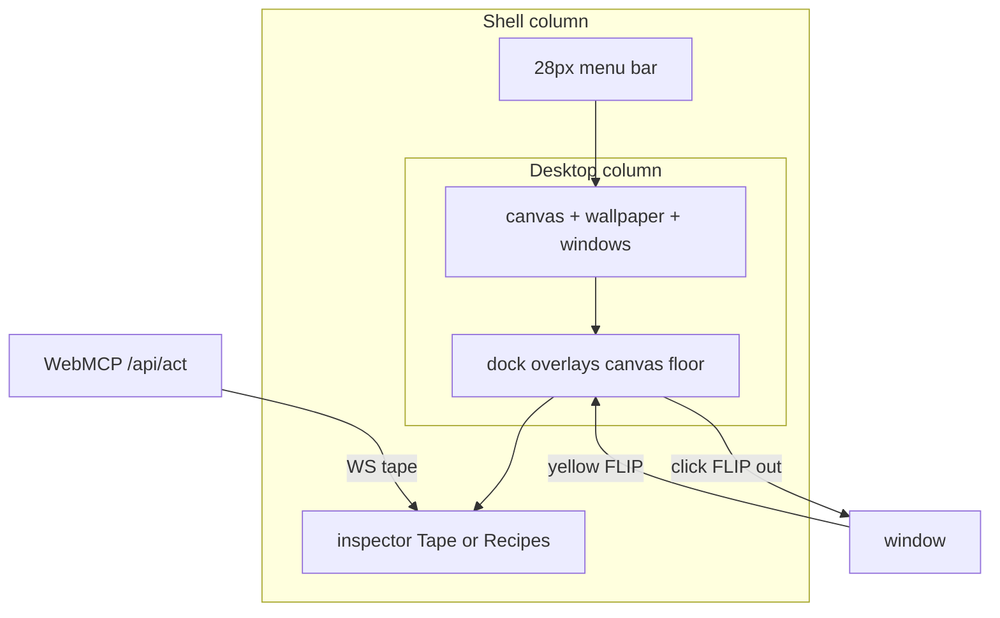

# Operator desktop — product and implementation spec

The page is not a website with a dock sticker. It is the **operator console for an agent-operated lab**: live Linux computers as windows, a fleet switcher in the dock, and a DevTools-class inspector for what just happened (and what to replay).

Implement against the working tree described in [HANDOFF.md](HANDOFF.md). How to work: [INSTRUCTIONS.md](INSTRUCTIONS.md). Done means [VERIFY.md](VERIFY.md).

---

## 1. Product thesis

The chrome today is a set of macOS citations (traffic lights, blur, a dock) on a **missing wallpaper**, with motion that does not travel through space, and an inspector that **replaces the desktop**. That reads as a student skin.

A professional operator desktop does three jobs at once:

1. **Place** — a surface you sit on (wallpaper, windows that live in space).
2. **Fleet** — switch, spawn, hide computers without thinking (dock).
3. **Inspector** — see what the agent just did, save it, replay it, without covering the machines.

Chrome DevTools is the model for (3): it **pushes the page**. macOS is the model for (1)–(2): the dock **never disappears**, because it is the minimize target.

Hiding the dock when the timeline opens is a strategy bug. Yellow-light FLIP has nowhere to go.



[`plans/DESIGN.md`](../DESIGN.md) still bans gradients and 8px radius. The **live CSS already chose glass**. Do not revert to Axiom-on-paper. Ember remains **only** on Approve (or the primary destroy choice).

---

## 2. Layout architecture (do this first)

`apps/web/src/ui/Shell.tsx` today: menubar + full-bleed `.desktop` + timeline as `position: fixed; inset: 0`.

**Target:**

```
grid-template-rows: 28px 1fr auto
[ MenuBar ]
[ .desktop  (canvas + dock overlay)  ]
[ .inspector (0 when closed; --insp-h when open, default 38vh) ]
```

- Opening Timeline / Recipes **shrinks the canvas**. `setCanvasSize` already follows a ResizeObserver. Maximize’s `ch - 88` dock inset must use the **real** canvas height after shrink.
- Dock **stays** at the bottom of `.desktop`, 14px above the inspector edge.
- Inspector height is drag-resizable (handle on the top edge), persisted as `localStorage.webmcp.insp-h`, min 220px, max 60vh.
- Esc: lightbox → inspector → approval. Menubar **Timeline** opens the Tape tab (filter All). Menubar **Recipes** opens the Recipes tab. Same panel.
- z-index: windows < dock < inspector < approval < boot. Shot lightbox lives **inside** the inspector.

Delete `.tl-root { inset: 0; z-index: 200 }`.

---

## 3. Surface and OS chrome

**Wallpaper.** CSS only on `.wm-wallpaper`: deep navy/graphite radial, faint horizon, 1–2% noise (inline SVG data-URI). Soft vignette. Delete `url(/canvas-bg.svg)` — the file is not in the repo. Drop the CRT `.grain` hatch. Idle dim (`.shell.idle`) may stay, quieter.

**Empty desk** (`Canvas.tsx`). Glass card on the wallpaper:

- Title: `WebMCP Computer`
- One sentence: tools are **already registered** on this page; spawn a computer to drive one
- Primary: **New Computer** (blank)
- Secondary, if archives exist: **Restore files…**
- Footer: dock = fleet, Timeline = tape, Recipes = teach

`.desk-blank` stays `pointer-events: none` except the card.

**Menu bar** — rebase on the current file:

- Wordmark: `WebMCP Computer`
- Items: **Timeline**, **Recipes**. Remove **Boot**
- Ticker: ellipsize; hide while a toast is visible (one channel)
- Right: quiet **Offline** (`apiOnline`), `! approval`, `WebMCP ready|missing`, lucide speaker, clock **without seconds** (tick on the minute)
- **No application BootSequence.** Delete the full-page BIOS, menubar Boot, and `booted` persist. First paint is the desktop. The only boot theater is the **in-window** overlay while `status === "starting"` (see [INSTRUCTIONS.md](INSTRUCTIONS.md) §6).

**Windows.**

- Delete `.wm-window:not(.selected) { opacity: 0.88 }` — it dims VNC. Focus = shadow + hairline only
- `title` attribute: `name · role · os`
- Acting: `AGENT · {verb}` in the titlebar. Dock bounce is the second signal
- **Timeline on every titlebar** (right cluster). Small `Timeline` label or 14px clock icon. `pointerdown` `stopPropagation` (same as traffic lights). Click: `selectComputer(id)`, open inspector Tape tab, `filter = id`, select newest event for that id. If already open, only filter/selection change. Menubar Timeline stays All
- Red light = destroy (approval). No genie. Yellow = minimize FLIP

**Identity.** `apps/web/index.html`: title, meta description, `theme-color`, SVG favicon (three traffic-light dots).

**Approval sheet.** `options[]` already render. When destroy offers `Destroy` / `Destroy and save files`, style those as the choices. `role="dialog"` while touching the sheet.

---

## 4. Dock

Keep a macOS dock, not a taskbar. It is the minimize target.

**Chrome.** Frosted capsule, 1px top highlight, one shadow. No icon reflections. Separator before + / restore.

**Icons.** One SVG display mark (rounded screen, 1px bezel), monogram inside, wallpaper as a tint only. Same weight as +. Do not mix lucide `Monitor` with the old CSS chin.

**State.**

- Selected: solid white dot
- Minimized: hollow dot — do not grey the icon into unreadability
- Acting: **one bounce**, not an Ember ring
- Error: thin red ring
- Spawn disabled: tooltip `Limit of N computers reached` via `MAX_COMPUTERS`

**+ tile.** Click = blank `spawnComputer()`. Chevron / long-press = Restore when `GET /api/archives` works.

**Magnify.** Cache tile centers on `pointerenter` and resize. Drive scale with `requestAnimationFrame` and CSS variables on the shelf. Neighbors scale by distance. Do **not** call `getBoundingClientRect` per tile per `mousemove`.

**Tile rects for motion.** Export `getDockTileRect(id): DOMRect | null` from the dock’s existing `tiles` map. If missing, fall back to dock shelf center — never `translateY(120px)`.

---

## 5. Motion

Tokens: keep `--ease-spring` / `--ease-out-expo`; add `--dur-window: 380ms`. Existing `prefers-reduced-motion` nuke stays; FLIP becomes instant hide/show.

**Minimize → tile.** Measure window rect and `getDockTileRect(id)`. Set `--genie-x/y/sx/sy` (transform-origin top-left). `lifecycle: "minimizing"`. Transition. `transitionend` → `finishMinimize`. Tile bounce once.

**Restore ← tile.** Mount at last bounds with inverted FLIP (`lifecycle: "restoring"`), transition to identity, `clearPhase`.

**Close / destroy.** Scale+fade in place (`0.96`). The approval sheet is the event.

**Maximize, snap, `arrange()`.** Transition `left/top/width/height` on `.wm-window`. Off while `.dragging` or `.resizing`. This is what makes `workspace_arrange_windows tile` look intended instead of a teleport.

**Drag.** Coalesce `pointermove` to one rAF `patchBounds` in `Window.tsx`.

Helper: `apps/web/src/ui/wm/motion.ts` — `flip(from: DOMRect, to: DOMRect)`. Geometry is measured in the view, not stored.

Overview (`` ` ``) already interpolates transform — leave it.

---

## 6. Inspector — Tape | Recipes

One panel, two tabs, one height, one Esc.

### 6.1 Tape (Chrome Performance, not a log)

```ts
events = merge(historyFetchOnOpen, store.tape)
```

`prependTape`: if `id` exists, **replace**. Cap 100.

**Chart**

- Ruler `HH:MM:SS` from `min(at)` to `max(at)+pad`
- One horizontal **lane per computer** (~120px name gutter). Filter chips hide lanes
- Each `TapeEvent` is a **bar**. Width = `durationMs` if present, else min ~8px
- Category color (muted): input / files / run / browser / recipe. Error = stroke only
- Wheel zooms about cursor; drag ruler pans; **Fit**. Click selects; ←/→ walks time
- **Delete `.tl-list` and `Compare`.** No slider. Delete all `.tl-compare*` CSS

**Detail** (~40% of panel)

- Header: op, time, computer, actor
- **Always two frames** (`.tl-shots`): Before | After. Missing = `.tl-shot.missing`. Click → lightbox inside the inspector
- Input / Output `<pre>`
- **Save as recipe**: name + description → `POST /api/actions/promote` `{ count, name, description }` (default last 10, or from selection to now). Then switch to Recipes with that id selected

Empty tape: “Actions will land here as the agent works.”

Panel enter: slide up 240ms. New bars grow width. No bounce on every WS event.

### 6.2 Recipes

Not a second overlay.

- List: name, description, step count, source (`tape` | `authored`), created
- **Replay** → `POST /api/actions/:id/replay` `{ speed? }`, `x-actor: human`, 130s timeout. `beginAct("replaying")`
- **Delete** → `DELETE /api/actions/:id`
- Empty: “Save a run from the Tape tab.”

No step editor in the UI. If `/api/actions` 404s, muted line and hide Save.

### 6.3 `durationMs`

Optional. See [HANDOFF.md](HANDOFF.md). This track does not edit `plane.ts`.

---

## 7. Archives (progressive)

When `GET /api/archives` exists:

- Empty card + dock chevron: name + size
- `spawnComputer({ restoreArchiveId })` → `POST /api/computers`

Destroy-and-save is **only** the approval sheet.

---

## 8. Sound — [uisfx](https://uisfx.com/), restrained

Replace homemade oscillators in `apps/web/src/ui/sound.ts`.

```bash
pnpm --filter @webmcp-computer/web add uisfx
```

```ts
createUISFX({
  pack: "minimal",
  volume: 0.45,
  preferences: { key: "webmcp.sound" },
});
```

`minimal` only. No `arcade` / `cinematic` / `scifi`. Unlock from a real gesture (`ui.unlock()` on first pointer/key on the shell). Until unlocked, drop async cues. Speaker toggle: `stopAll()` then `setEnabled`. `play()` may return `null`. `prefers-reduced-motion` is **not** mute.

Guide: https://uisfx.com/docs/agent-guide.md  
Catalog: https://uisfx.com/uisfx-catalog.json

**Cue map (complete):**

| Event | Cue |
|-------|-----|
| Agent `typeText` per character | `typing` at ~0.25 volume |
| Inspector open / close | `open` / `close` |
| Dock tile changes selection | `select` |
| Edge-snap or maximize settle | `snap` |
| Approval sheet appears | `warning` |
| Destroy committed (after approve) | `delete` |
| Spawn at cap | `blocked` |
| Sound preference | `toggle-on` / `toggle-off` |
| Mutating `act` failed | `error` (once) |
| `apiOnline` flip | `connect` / `disconnect` (cooldown) |

**Do not play:** hover, press/release, window focus, pointermove, boot-sequence ticks, toasts, tape WS arrivals, drag-start, `processing` / `loading` loops, reward / commerce / media.

Boot: silence, or one `wake` at the end.

---

## 9. Agent typing at 60 WPM

Today `apps/bridge/src/desktop.ts` `typeText` is `xdotool type -- <entire string>`. The guest jumps. A typewriter sound on top of that is a lie.

**Guest:**

```ts
// 60 WPM ≈ 5 chars/s ≈ 200 ms between keys (5 chars/word).
await xd(["type", "--delay", "200", "--", text]);
```

One `MachineOp`, one tape event, one HTTP call. Do **not** split into N `/api/act`s.

**Timeout** in `http-machine.ts`:

```ts
typeText: min(120_000, 1_000 + text.length * 220)
```

Longer than ~600 characters: 200ms/key up to the cap, remainder may use delay 0 so `/api/act` does not exceed 120s. Mention the cap on `computer_type`.

**Host sound** (in `MachineTools.act` or a helper): if `op.op === "typeText"` and sound is on, interval 200ms, each tick `ui.play("typing")`, clear in `finally`. Mute stops immediately.

Human VNC typing is silent. `computer_key` stays instant. Recipe replay that hits `typeText` inherits the delay.

---

## 10. Out of scope

- Mesh / WebGL genie — FLIP-to-tile only
- Hide the dock when the inspector opens
- A `processing` loop or dump-sound instead of paced `typing`
- `typing` for human VNC or for `key` chords
- Wallpaper photograph or a 1 MB asset
- Desktop icons, fake HD, light mode
- Re-poll `/api/tape`
- Rewrite WebMCP tools or `plane.ts`
- A second Actions modal
- Dead-CSS purge of `.nav` / `.machine-list` as a phase
- A11y as a phase — `role="dialog"` on inspector + approval while touching them

---

## 11. Files

| Path | Change |
|------|--------|
| `apps/web/src/ui/Shell.tsx` | Column layout, inspector host |
| `apps/web/src/ui/inspector/Inspector.tsx` | New — tabs, resize |
| `apps/web/src/ui/ActionTimeline.tsx` | Waterfall + shots; keep merge |
| `apps/web/src/ui/inspector/RecipesPanel.tsx` | New |
| `apps/web/src/ui/wm/motion.ts` | New — FLIP helper |
| `apps/web/src/ui/wm/Window.tsx` | Genie, titlebar Timeline, rAF drag, tooltip |
| `apps/web/src/ui/wm/Canvas.tsx` | Empty card |
| `apps/web/src/ui/Dock.tsx` | Icons, magnify, bounce, tile rects |
| `apps/web/src/ui/MenuBar.tsx` | Rebase chrome |
| `apps/web/src/ui/sound.ts` | uisfx |
| `apps/web/src/store/slices/wm.ts` | `restoring` |
| `apps/web/src/store/slices/server.ts` | `prependTape` replace-by-id |
| `apps/web/src/styles/axiom.css` | Wallpaper, dock, genie, inspector; delete `.tl-compare` |
| `apps/web/index.html` | Identity |
| `apps/bridge/src/desktop.ts` | `--delay 200` |
| `apps/api/src/http-machine.ts` | `typeText` timeout |
| `apps/web/src/webmcp/MachineTools.tsx` | Typing scheduler |
| `apps/web/src/store/slices/wm.test.ts` | Restore phase |
